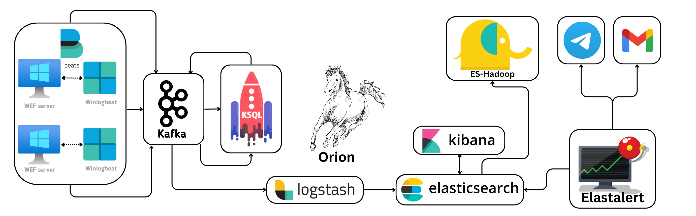

# Cloud-HELK

Clone the repository and start HUNTING
```
git clone https://github.com/ramz-021002/Cloud-HELK.git
```

## Introduction
This repository is taken from [HELK repository](https://github.com/Cyb3rWard0g/HELK)

I thank [Sibi Chakkaravarthy Sethuraman](https://github.com/sibichakkaravarthy), for guiding me in making the modifications and deploying HELK in cloud platforms like AWS.


## Installation
Once you clone the repository and your logs are ready to be sent to HELK using Beats, update the Kafka listener IP using 
```
export ADVERTISED_LISTENER=<PUBLIC_IP OF SERVER>
```
Once the export is successfully done, run docker-compose the same way it was used to build the HELK. This would result in re-creating the environment with a newly assigned environment variable.

```
sudo -E docker-compose -f helk-kibana-notebook-analysis-basic.yml up -d
```
For help in installation, you can visit the official [HELK](https://thehelk.com/intro.html) documentation, but make sure you clone this repository for deploying in HELK the cloud.
